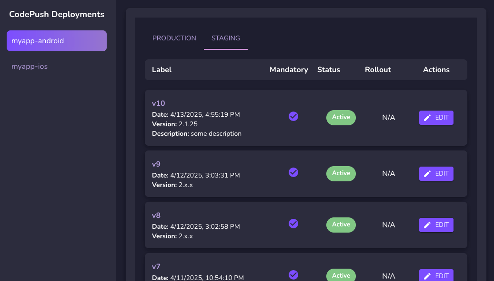

# Code Push Frontend

## Overview

This project is the frontend for the Code Push application, which facilitates seamless updates to applications by integrating with a backend service. It is built using modern web technologies to provide a user-friendly interface for managing updates.

## Features

- Manage application updates.
- View update history and status.
- Seamless integration with the backend API.

## Screenshot

Below is a screenshot of the application:



## Security Note

This frontend is **not protected** by default. It should be deployed behind an SSO proxy or integrated with your own login system to ensure secure access.

## Prerequisites

- Node.js (version 16 or higher)
- npm or yarn package manager

## Setup Instructions

1. Clone the repository:

   ```bash
   git clone <repository-url>
   cd code-push-frontend
   ```

2. Install dependencies:

   ```bash
   npm install
   # or
   yarn install
   ```

3. Start the development server:

   ```bash
   npm start
   # or
   yarn start
   ```

4. Open your browser and navigate to `http://localhost:3002`.

## Generating a Token

To interact with the backend API, you need a valid token. You can generate one using the `code-push-standalone` CLI:

1. Install the CLI if you haven't already:

   ```bash
   npm install -g code-push-standalone
   ```

2. Run the following command to generate a token:

   ```bash
   code-push access-key add "<description>"
   ```

3. Copy the generated token and use it in the frontend configuration or as required.

## Configuration

To customize the application, you can use a `config.js` file, environment variables, or pass parameters at runtime.

### Steps to Configure

1. Create a `.env` file in the project directory to define environment variables:
   ```bash
   APP_TOKEN=your_token_here
   BACKEND_URL=https://api.mycodepush.com
   ```

2. Alternatively, you can pass these parameters directly when starting the application:
   ```bash
   APP_TOKEN=your_token_here BACKEND_URL=https://api.mycodepush.com yarn start
   ```

3. Restart the application for changes to take effect.

### Fields

- `APP_TOKEN`: The token generated using the `code-push-standalone` CLI.
- `BACKEND_URL`: The base URL of your backend API.

## Build for Production

To create a production build, run:

```bash
npm run build
# or
yarn build
```

The build artifacts will be stored in the `dist/` directory.

## Build and Run with Docker

To build and run the application using Docker:

1. Build the Docker image:
   ```bash
   docker build -f Dockerfile . -t codepush-fe
   ```

2. Run the Docker container:
   ```bash
   docker run -p 8083:80 -e APP_TOKEN=your_token_here -e BACKEND_URL=https://api.mycodepush.com codepush-fe
   ```

3. Access the application at `http://localhost:8083`.

You can also use a `.env` file for Docker by passing it with the `--env-file` option:
   ```bash
   docker run -p 8083:80 --env-file .env codepush-fe
   ```

## Contributing

Contributions are welcome! Please follow these steps:

1. Fork the repository.
2. Create a new branch for your feature or bugfix.
3. Commit your changes and push the branch.
4. Open a pull request.
